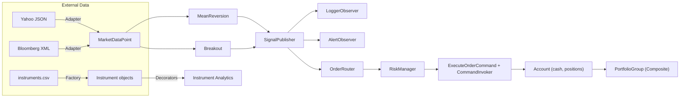

# Assignment 6 — Design Patterns in Financial Software Architecture

A modular, testable **analytics & trading simulation** that demonstrates core GoF patterns across data ingestion, strategy execution, eventing, risk & routing, execution with undo/redo, portfolio aggregation, and analytics decoration.

---

## ✨ Features (Pattern → Module)
- **Factory** → `patterns/factory.py` — build `Stock/Bond/ETF` from `instruments.csv`
- **Singleton** → `patterns/singleton.py` — global `Config` loads `config.json` once
- **Builder** → `builder.py` — fluent portfolio builder; `from_json()`
- **Adapter** → `dataloader.py` — normalize Yahoo JSON & Bloomberg XML to `MarketDataPoint`
- **Composite** → `portfolio_components.py` — `PortfolioGroup` and `Position` aggregation
- **Decorator** → `analytics.py` — add `volatility`, `beta`, `max_drawdown` via stacking
- **Strategy** → `patterns/strategy.py` — `MeanReversionStrategy`, `BreakoutStrategy`
- **Observer** → `patterns/observer.py` — `SignalPublisher`, `LoggerObserver`, `AlertObserver`
- **Command** → `patterns/command.py` — `ExecuteOrderCommand`, `CommandInvoker`, `Account`
- **Engine** → `engine.py` — orchestration: data → strategies → observers → router → risk → commands

---

## 📦 Project Structure
```
Assignment6_Design_PatternsinFinancialSoftwareArchitecture/
├─ analytics.py
├─ builder.py
├─ dataloader.py
├─ engine.py
├─ main.py
├─ models.py
├─ portfolio_components.py
├─ patterns/
│  ├─ __init__.py
│  ├─ command.py
│  ├─ factory.py
│  ├─ observer.py
│  ├─ singleton.py
│  └─ strategy.py
├─ tests/
│  ├─ conftest.py
│  ├─ test_analytics.py
│  ├─ test_command.py
│  ├─ test_dataloader.py
│  ├─ test_engine_integration.py
│  ├─ test_factory.py
│  ├─ test_observer_command_flow.py
│  └─ test_strategy.py
├─ data/
│  ├─ config.json
│  ├─ instruments.csv
│  ├─ market_data.csv
│  ├─ external_data_yahoo.json
│  ├─ external_data_bloomberg.xml
│  └─ portfolio_structure.json
└─ design_report.md
```

> If you see `ModuleNotFoundError` during tests, ensure you run from the **project root** and add a `pytest.ini` with `pythonpath = .` (see Troubleshooting).

---

## 🚀 Quick Start

### 1) Requirements
- Python 3.10+
- Optional: create a virtual env

```bash
python -m venv .venv
source .venv/bin/activate  # (Windows) .venv\Scripts\activate
pip install -U pip pytest
```

### 2) Data Placement
Place the provided data files under `data/`:
```
data/
  config.json
  instruments.csv
  market_data.csv
  external_data_yahoo.json
  external_data_bloomberg.xml
  portfolio_structure.json
```

Ensure `data/config.json` contains:
```json
{ "data_path": "data" }
```

### 3) Run the demo
```bash
python main.py
```
This will:
1. Load instruments via **Factory**.
2. Load market data via **Adapters** and CSV.
3. Merge & sort ticks; run **both strategies** per tick.
4. Publish signals (**Observer**) → route → risk-check → execute (**Command**) → update **Account**.

---

## 🧪 Run Tests

Install pytest and run from project root:
```bash
pip install pytest
pytest -q
```
Or with coverage:
```bash
pip install pytest-cov
pytest -q --cov=. --cov-report=term-missing
```

> If pytest can’t import modules, add `pytest.ini`:
> ```ini
> [pytest]
> pythonpath = .
> ```

---

## 🧠 Architecture (Mermaid)


**Why left-to-right?** Clear view of the single-pass engine: every tick → every strategy, then fan-out to observers & execution.

---

## ⚙️ Configuration

- `patterns/singleton.py::Config` loads `data/config.json` once.
- Access anywhere:
  ```python
  from patterns.singleton import Config
  cfg = Config("data/config.json")  # first time loads
  another = Config()                # reuse existing instance
  path = cfg.get("data_path", "data")
  ```

---

## 🧩 Strategy Notes

- **Mean Reversion**
  - Rolling window per symbol via `deque`; warm-up gate `max(2, window/4)`.
  - BUY if `price < mean * (1 - threshold)`, SELL if `price > mean * (1 + threshold)`.

- **Breakout**
  - **Important:** compute `rolling_high/low` **before** appending current price; then append.
  - BUY if `price > rolling_high`; SELL if `price < rolling_low`.

- Both strategies return `Signal(...).as_dict()` with fields: `symbol`, `action`, `size`, `price`, `meta`.

---

## 🧾 Commands & Execution

- `ExecuteOrderCommand.from_signal(account, signal)` bridges signals to trades.
- `CommandInvoker` supports `undo()` / `redo()` for demos/tests.
- `Account` tracks `cash` and `positions` (signed quantities).

Example:
```python
from patterns.command import Account, ExecuteOrderCommand, CommandInvoker

acct = Account(100_000)
inv = CommandInvoker()
sig = {"symbol": "AAPL", "action": "BUY", "size": 10, "price": 150.0}
cmd = ExecuteOrderCommand.from_signal(acct, sig)
inv.execute_cmd(cmd)   # executes trade
inv.undo(); inv.redo() # demo reversibility
```

---

## 🧱 Portfolio (Composite) & Builder

- **Composite:** `PortfolioGroup` and `Position` expose `get_value()` and `get_positions()`.
- **Builder:** Construct nested portfolios, or load from JSON:
```python
from builder import PortfolioBuilder
root = PortfolioBuilder.from_json("data/portfolio_structure.json").build()
print(root.get_value(), root.get_positions())
```

---

## 🧪 Analytics via Decorators

- Wrap instruments without modifying base class:
```python
from analytics import VolatilityDecorator, BetaDecorator, DrawdownDecorator
wrapped = DrawdownDecorator(BetaDecorator(VolatilityDecorator(stock)))
metrics = wrapped.get_metrics()
# {'symbol':..., 'price':..., 'volatility':..., 'beta':..., 'max_drawdown':...}
```

---

## 🧯 Troubleshooting

**`ModuleNotFoundError: No module named 'patterns'`**
- Run commands from the **project root**.
- Ensure `patterns/__init__.py` exists.
- Add `pytest.ini` in root:
  ```ini
  [pytest]
  pythonpath = .
  ```
- In VS Code, set the run configuration cwd to the project root.

**Breakout test not firing**
- Ensure bounds are computed **before** appending the current price.

**Mean reversion not emitting signals**
- Provide enough warm-up ticks, or reduce `window`, or adjust `threshold`.

---

## 📄 License
For course use. 
