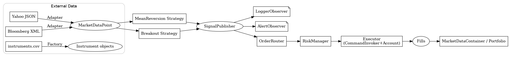

# Design Report

**Project:** Assignment – Design Patterns in Financial Software Architecture  
**Audience:** Teammates, TAs, Future Contributors  
**Scope:** Summary of patterns used, rationale, trade-offs, and how pieces fit together

---

## 1) Architecture Overview

The system ingests heterogeneous market/instrument data, normalizes it, produces trading **signals**, converts them into **orders**, executes orders via the **Command** pattern, and updates a live **position book/portfolio**. Cross-cutting concerns (logging/alerts) are handled by **Observer**.

---

## 2) Creational Patterns

### 2.1 Factory — `InstrumentFactory.create_instrument(data: dict) -> Instrument`
**Problem:** Map CSV rows to `Stock`, `Bond`, `ETF` (and future types) without `if/elif` scattered everywhere.  
**Rationale:** Centralizes object creation and data validation/transforms.  
**Trade-offs:**
- ✅ Easy to extend with new instruments.
- ✅ Single place for field coercion (e.g., `float(coupon)`).
- ❌ Adds an indirection layer; errors surface at runtime if `type` is wrong.
- ❌ If growth continues, consider a registration map to avoid long `if` chains.

### 2.2 Singleton — `Config`
**Problem:** Multiple modules need consistent config (paths, params) without re-reading files.  
**Rationale:** Cache JSON once, provide `get(key)` everywhere.  
**Trade-offs:**
- ✅ Eliminates repeated IO and “who owns config?” debates.
- ✅ Guarantees global consistency.
- ❌ Global state complicates tests; consider a reset/reload hook for test fixtures.
- ❌ Add a lock if multithreaded initialization is possible; path only effective on first instantiation.

### 2.3 Builder — `PortfolioBuilder`
**Problem:** Construct nested portfolios with positions, sub-portfolios, metadata.  
**Rationale:** Fluent API; JSON → builder → immutable(ish) composite tree.  
**Trade-offs:**
- ✅ Readable construction; easy to recreate from JSON.
- ✅ Keeps complex construction logic out of the `Portfolio` class.
- ❌ Slight verbosity; ensure `build()` is side-effect-free and fast.
- ❌ Runtime changes to positions should not go through Builder (use runtime sinks).

---

## 3) Structural Patterns

### 3.1 Adapter — `YahooFinanceAdapter`, `BloombergXMLAdapter`
**Problem:** Normalize heterogeneous data formats (JSON/XML) to one `MarketDataPoint` model.  
**Rationale:** Encapsulate format parsing; the rest of the system consumes a standard type.  
**Trade-offs:**
- ✅ Clean boundary with external providers.
- ✅ Swappable if formats change.
- ❌ You must maintain multiple adapters; add schema checks and better error messages.
- ❌ Beware content drift (timestamp formats, field names).

### 3.2 Decorator — `VolatilityDecorator`, `BetaDecorator`, `DrawdownDecorator`
**Problem:** Add analytics to instruments without modifying base class.  
**Rationale:** Pluggable metrics that compose at runtime.  
**Trade-offs:**
- ✅ No base-class changes, flexible stacking.
- ✅ Unit test each metric independently.
- ❌ Ordering & duplicate keys need conventions (later decorator can override prior keys).
- ❌ Ensure you call the wrapped object’s `get_metrics()` to merge results.

### 3.3 Composite — `Portfolio` (Groups + Positions)
**Problem:** Treat positions and groups uniformly (`get_value()`, `get_positions()`).  
**Rationale:** Tree structure with recursive aggregation.  
**Trade-offs:**
- ✅ Naturally models nested portfolios.
- ✅ Easy aggregation via recursion.
- ❌ Navigating/updating leaves requires careful APIs; keep runtime fills separate from structural build.

---

## 4) Behavioral Patterns

### 4.1 Strategy — `MeanReversionStrategy`, `BreakoutStrategy`
**Problem:** Interchangeable trading logic under a common interface.  
**Rationale:** Each strategy maintains its own state (sliding windows) and emits signals.  
**Trade-offs:**
- ✅ Easy A/B testing and replacement.
- ✅ Parameterization via JSON/Config.
- ❌ Parameter sprawl; centralize param loading and defaults.
- ❌ Implementation notes: In Breakout, compute rolling high/low **before** appending current price (or exclude current) to avoid never-triggering conditions.

### 4.2 Observer — `SignalPublisher` + `LoggerObserver`, `AlertObserver`
**Problem:** React to signals with side effects (logging, alerts) without hard coupling.  
**Rationale:** Strategies don’t know who listens; observers subscribe dynamically.  
**Trade-offs:**
- ✅ Extensible (add KPIs, persistence, telemetry later).
- ❌ Execution order of observers is unspecified; document if ordering matters.
- ❌ Swallowing exceptions in observers prevents breaking the flow but can hide bugs—log clearly.

### 4.3 Command — `ExecuteOrderCommand`, `CommandInvoker`, `Account`
**Problem:** Encapsulate order execution with undo/redo and history.  
**Rationale:** Commands carry context; invoker manages stacks for undo/redo.  
**Trade-offs:**
- ✅ Testable, reversible actions; clean separation from account state.
- ✅ Fits backtesting and interactive UIs (undo/redo).
- ❌ State management (already executed/not executed) adds complexity.
- ❌ For high-throughput sims, command objects add overhead—batching may be needed.

---

## 5) Trading Engine Orchestration (Glue, not Logic)

A lightweight **TradingEngine** wires everything:
1. **Data source** (iterable of `MarketDataPoint`)
2. **Strategies** → `generate_signals(tick)`  
3. **SignalPublisher.notify(signal)** (observers for logging/alerts/metrics)  
4. **OrderRouter** (signal → `Order`)  
5. **RiskManager** (approve/resize/reject)  
6. **Executor** (CommandInvoker + Account)  
7. **Portfolio/Container sink** (apply fills to runtime positions)

**Design rules:**
- Engine does **no** indicator math, parsing, or account math.
- Each dependency has a tiny interface; any piece can be swapped in tests.
- Keep **runtime positions** (fills) separate from the **built portfolio tree**. Builder is for structure; fills update a live book (`MarketDataContainer` / `Account`).

---

## 6) Data Loader Integration

- `DataLoader` composes **Adapter** (Yahoo/Bloomberg) and **Factory** (instruments.csv).  
- It returns standard types (`MarketDataPoint`, `Instrument`) so downstream modules don’t care about file formats.  
- Prefer generator style (`yield`) for streaming backtests; lists are fine for small datasets.

---

## 7) Testing Strategy

**Unit tests by pattern:**
- **Factory**: type mapping, field coercion, bad `type` errors.
- **Singleton**: same instance; temp config file; error message on malformed JSON.
- **Builder/Composite**: nested aggregation, leaf enumeration, JSON round-trip.
- **Decorators**: each metric with deterministic sequences; stacking merges keys.
- **Adapters**: parse fixtures; timestamp correctness; symbol mismatch raises.
- **Strategy**: canned price streams yield expected signals (MR threshold, Breakout edges).
- **Observer**: spies capture notifications; errors in observers don’t break flow.
- **Command**: execute/undo/redo with cash & positions invariants.

**Integration tests:**
- Fake data iterator + fake strategy emitting known signals → ensure router/risk/executor/sink called in order.  
- End-to-end dry run prints positions/cash and observer logs.

---

## 8) Key Trade-offs & Alternatives

| Concern | Choice | Why | Trade-off / Alternative |
|---|---|---|---|
| Object creation | Factory | Centralized mapping & validation | Registry map to avoid long `if`; or use dataclass `from_dict` with type map |
| Global config | Singleton | One source of truth | Harder to test; inject config object or add `reload()` for tests |
| Portfolio build | Builder + Composite | Clean structure & recursion | Runtime fills separate; or use a mutable composite with thread-safe updates |
| Analytics | Decorator | Zero changes to base class | Key collisions; define a naming convention or namespacing |
| Data normalization | Adapter | Hide external formats | Need maintenance as providers change; add schema validation |
| Strategy swap | Strategy | A/B friendly | Param sprawl; add param schemas & defaults |
| Side effects | Observer | Pluggable listeners | Ordering/visibility; add structured logging & error counters |
| Execution | Command | Undo/redo, testable | Overhead in high-throughput; micro-batch commands for sims |

---

## 9) Performance & Robustness Notes

- **Time windows**: Deques with `maxlen` are O(1) append; rolling max/min are O(window) unless you switch to monotonic queues.
- **Numeric stability**: Distinguish sample vs population stats; consider `Decimal` for cash/price if cents matter.
- **Timestamps**: Normalize to timezone-aware `datetime` (UTC) at adapters.
- **Error handling**: Adapters/Factory should raise precise errors with file+line context; observers should log tracebacks.

---

## 10) Future Enhancements

- **RiskManager v2**: exposure, per-symbol limits, notional caps, circuit breakers.
- **Execution model**: slippage, fees, partial fills, market/limit orders.
- **Portfolio sink**: realized/unrealized PnL, FIFO/LIFO lots, shorting support.
- **MetricsObserver**: Prometheus/CSV for signals, fills, PnL over time.
- **Config hygiene**: JSON schema validation; environment overrides.
- **Engine modes**: backtest (historical iterator), paper (sim fills), live (broker API adapter).

---

## 11) “How to Read the Code” Map

- **patterns/**
  - `factory.py` — instrument creation
  - `singleton.py` — config
  - `decorators.py` — metrics
  - `observer.py` — publisher + observers
  - `command.py` — command + invoker + account
- **core/**
  - `strategy.py` — strategies
  - `portfolio.py` / `builder.py` — composite + builder
- **io/**
  - `dataloader.py` — adapters + CSV loader
- **models/**
  - `MarketDataPoint`, `Portfolio`, `Order`, etc.
- **engine/**
  - `engine.py` — orchestration (data → signals → orders → fills)

---

## 12) TL;DR

- We used **Factory/Singleton/Builder** to construct and configure domain objects safely.  
- We used **Adapter/Decorator/Composite** to normalize data, add metrics, and represent hierarchical portfolios.  
- We used **Strategy/Observer/Command** to generate signals, handle side effects, and execute orders with undo/redo.  
- A thin **TradingEngine** orchestrates everything without leaking responsibilities.  

