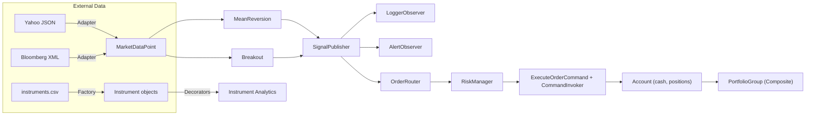

# Design Report — Assignment 6: Design Patterns in Financial Software Architecture

## 1) Goal & Scope
Build a modular, testable **analytics + trading simulation** that:
- Ingests heterogeneous market data (CSV, JSON, XML).
- Normalizes it into a common model (`MarketDataPoint`).
- Runs **multiple strategies** per tick (Mean Reversion, Breakout).
- Publishes signals to observers (logging/alerts/metrics).
- Routes + risk-checks signals into orders.
- Executes orders with **undo/redo** (Command pattern).
- Maintains positions/cash and aggregates portfolio value (Composite).
- Extends instrument analytics via **decorators** without editing core classes.

---

## 2) Architecture Overview

**Data Sources → Adapters → MarketDataPoint → Strategies → Publisher(Observers) → Router → Risk → Commands(Invoker+Account) → Positions/Portfolio(Composite) → Reporting/Analytics(Decorators)**



**Principles**
- Thin engine; strategies hold state.
- Sources isolated behind **adapters**.
- Behavior via **strategies** and **observers** (plug-and-play).
- State changes are explicit & reversible (**Command**).

---

## 3) Creational Patterns

### Factory
- **Problem:** Create `Stock`, `Bond`, `ETF` from `instruments.csv`.
- **Impl:** `InstrumentFactory.create_instrument(row) -> Instrument`.
- **Why:** Centralized construction, single responsibility.
- **Tradeoff:** Add branches for new types (or switch to registry when many types).

### Singleton
- **Problem:** Shared configuration (paths, parameters).
- **Impl:** `Config` (loads once from `config.json`; reused everywhere).
- **Why:** Consistent settings without manual plumbing.
- **Tradeoff:** Global state—keep API small and read-only after init.

### Builder
- **Problem:** Build nested portfolios from JSON.
- **Impl:** `PortfolioBuilder` (`add_position`, `add_subportfolio`, `build`, `from_json`).
- **Why:** Separates construction from representation; repeatable builds.
- **Tradeoff:** Extra layer, but valuable for nested structures and tests.

---

## 4) Structural Patterns

### Adapter
- **Problem:** External formats differ (Yahoo JSON, Bloomberg XML).
- **Impl:** `YahooFinanceAdapter.get_data(symbol)`, `BloombergXMLAdapter.get_data(symbol)` → `MarketDataPoint`.
- **Why:** Vendor-agnostic engine; shared internal shape.
- **Tradeoff:** One adapter per vendor—explicit and simple.

### Composite
- **Problem:** Aggregate positions & sub-portfolios uniformly.
- **Impl:** `PortfolioComponent` (abstract), `Position` (leaf), `PortfolioGroup` (composite).
  - `get_value()` sums recursively; `get_positions()` flattens symbol → qty.
- **Why:** Treat groups and leaves identically.
- **Tradeoff:** Recursive traversal—keep methods pure/simple.

### Decorator
- **Problem:** Add analytics without modifying core `Instrument`.
- **Impl:** `InstrumentDecorator` base; `VolatilityDecorator`, `BetaDecorator`, `DrawdownDecorator` add fields in `get_metrics()`.
- **Why:** Stackable analytics; open for extension.
- **Tradeoff:** Ensure each decorator reads stable base fields; avoid order dependence.

---

## 5) Behavioral Patterns

### Strategy
- **Problem:** Interchangeable trading logic.
- **Impl:** `Strategy.generate_signals(tick)`; `MeanReversionStrategy`, `BreakoutStrategy`.
  - Mean reversion uses rolling mean with threshold band.
  - Breakout compares **current price vs. prior window** (compute bounds *before* appending current price).
- **Why:** Engine is generic; strategies are pluggable and testable.
- **Tradeoff:** Warm-up windows and per-symbol state—document gating.

### Observer
- **Problem:** Decouple signal side-effects.
- **Impl:** `SignalPublisher.attach/detach/notify`; `LoggerObserver`, `AlertObserver`, optional `MetricsObserver`.
- **Why:** Add logging/alerts without touching the engine or strategies.
- **Tradeoff:** Fan-out must be robust (swallow/handle observer errors).

### Command (+ Invoker)
- **Problem:** Executable, undoable trades.
- **Impl:** `ExecuteOrderCommand(account, symbol, action, quantity, price)`; `CommandInvoker` manages history/redo; `Account` stores cash/positions.
  - `from_signal()` bridges strategy signals → commands.
- **Why:** Deterministic, reversible transitions; ideal for demos/tests.
- **Tradeoff:** Slight ceremony; payoff in correctness and auditability.

---

## 6) Engine Orchestration

**Loop (single pass; both strategies per tick):**
1. Merge ticks from adapters + CSV; sort by timestamp.
2. For each tick:
   - For each strategy: `signals = strat.generate_signals(tick)`.
   - For each signal:
     - `publisher.notify(signal)` (observers run).
     - `router.route(signal)` (identity in baseline).
     - `risk.approve(order)` (size/position limits).
     - `ExecuteOrderCommand.from_signal(account, order)`; `invoker.execute_cmd(cmd)`.
3. Positions/cash recorded in `Account`; portfolio aggregation via Composite if desired.

**Why outer loop over data?**  
If data is an iterator, looping strategies first would exhaust data for the first strategy. Current design ensures both strategies see the same tick.

---

## 7) Data Ingestion

- **Adapters:** Yahoo JSON / Bloomberg XML → `MarketDataPoint`.
- **CSV:** `read_ticks_csv()` yields `MarketDataPoint` (streaming; UTC-aware timestamps).
- **Instruments:** `instruments.csv` → Factory → domain objects.
- **Merging:** Combine adapter ticks with CSV ticks; `sorted(..., key=lambda t: t.timestamp)`.

---

## 8) Testing Strategy

- **Factory**: Creates correct subclass; errors on unknown type.
- **Singleton**: Same instance reused; reads config values.
- **Strategies**: Mean reversion & breakout generate expected signals (ensure breakout compares against history).
- **Observer**: Logger/alerts receive notifications; detach works; exceptions don’t break publish flow.
- **Command**: Execute/undo/redo correctness; idempotency guards; `from_signal` preserves fields & meta.
- **Adapters/DataLoader**: JSON/XML/CSV parse to `MarketDataPoint` with proper timestamps.
- **Analytics (Decorators)**: Keys present; formulas/ranges; stacking order independent; base metrics not mutated.
- **Integration**: Minimal engine run produces a trade and updates `Account`.

**Pytest tips**
- Use absolute imports in tests (e.g., `from patterns.command import ...`).
- Add `pytest.ini` with:
  ```ini
  [pytest]
  pythonpath = .
  ```
  or adjust `tests/conftest.py` to insert the project root into `sys.path`.

---

## 9) Key Design Decisions & Trade-offs

1. **Thin Engine**: Pure orchestration; no indicator math—keeps coupling low.
2. **Per-Strategy State**: Rolling windows inside strategies; warm-up gating reduces noise.
3. **Breakout Correctness**: Compare to history **before** appending the current price.
4. **Command for Execution**: Enables undo/redo and deterministic tests (extra code, big payoff).
5. **Adapters**: New vendors don’t touch engine/strategies.
6. **Composite Portfolio**: Uniform aggregation across nested groups.
7. **Decorators**: Analytics opt-in and stackable; base `Instrument` stays unchanged.

---

## 10) Extensibility & Future Work

- **Risk**: sector/net exposure limits, P&L stops, VAR.
- **Router/Execution**: venues, slippage/fees, partial fills, latency.
- **Strategies**: momentum, pairs, multi-asset, portfolio-level.
- **Valuation**: bind `Position.price` to last tick per symbol; daily NAV and performance metrics.
- **Persistence**: event logs, fills, positions to disk/DB.
- **Config**: broaden `config.json`/`strategy_params.json`; environment-specific overrides.
- **Performance**: batch processing or per-tick parallelism across strategies.

---

## 11) How to Run

```bash
# from project root
python main.py
```

**Data expectations**
- `config.json` includes `"data_path"` pointing to your `data/` folder.
- Place `market_data.csv`, `external_data_yahoo.json`, `external_data_bloomberg.xml`, `instruments.csv`, `portfolio_structure.json` under `data/`.

**Run tests**
```bash
pip install pytest
# optional: add pytest.ini with 'pythonpath = .'
pytest -q
```

---

## 12) Summary

This codebase demonstrates how classic **GoF patterns** compose into a cohesive trading simulation:

- **Factory / Builder / Singleton**: object creation & configuration.
- **Adapter / Composite / Decorator**: structural flexibility and integration.
- **Strategy / Observer / Command**: behavior encapsulation, decoupled side-effects, and reversible execution.

The result is a modular, readable, and easily testable system where new strategies, data sources, analytics, and execution logic can be added with minimal ripple across the code.
